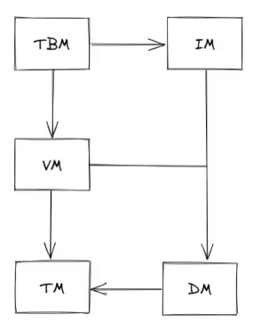
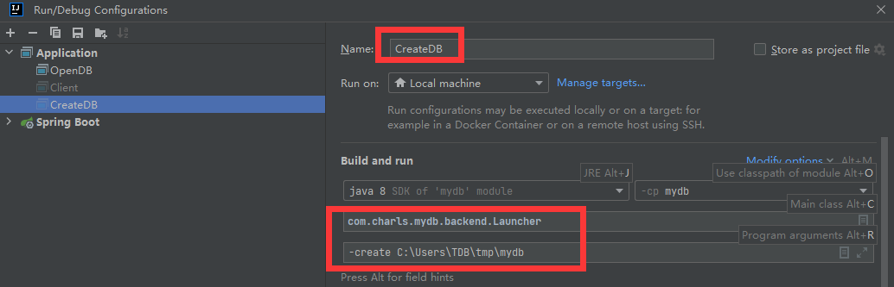
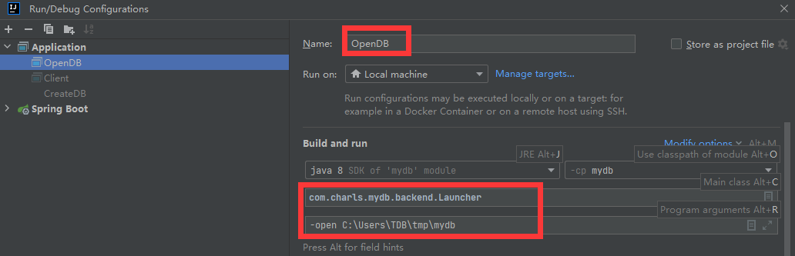
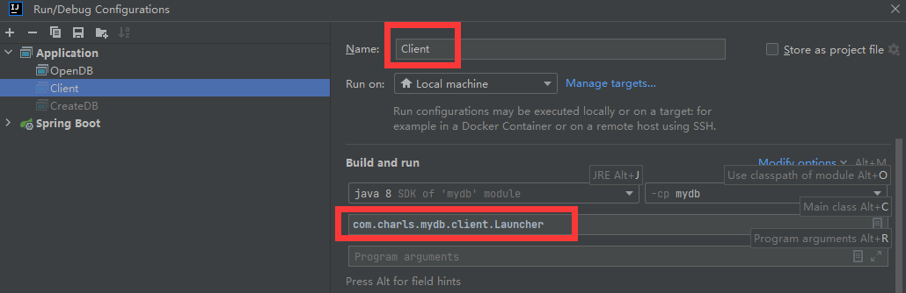

# MyDB

MyDB 是一个 Java 实现的简单的数据库，部分原理参照自 MySQL、PostgreSQL 和 SQLite。实现了以下功能：

- 数据的可靠性和数据恢复
- 两段锁协议（2PL）实现可串行化调度
- MVCC（多版本并发控制）
- 两种事务隔离级别（读提交和可重复读）
- 死锁处理
- 简单的表和字段管理
- 简陋的 SQL 解析（因为懒得写词法分析和自动机，就弄得比较简陋）
- 基于 Socket 的 Server 和 Client

## 项目结构
前端 + 后端 

前端：读取用户输入，发送到后端执行，输出返回结果，等待下一次输入 

后端：解析 SQL，如果是合法的 SQL，尝试执行并返回结果

后端划分为五个模块，每个模块通过接口向其依赖的模块提供方法 

五个模块：

```txt
1. Transaction Manager (TM)   ==> 事务管理模块
2. Data Manager (DM)          ==> 数据管理模块
3. Version Manager (VM)       ==> 版本管理模块
4. Index Manager (IM)         ==> 索引管理模块
5. Table Manager (TBM)        ==> 表管理模块
```


每个模块的职责如下：

1. TM 通过维护 XID 文件来维护事务的状态，并提供接口供其他模块来查询某个事务的状态。

2. DM 直接管理数据库 DB 文件和日志文件。DM 的主要职责有：

    1) 分页管理 DB 文件，并进行缓存；

    2) 管理日志文件，保证在发生错误时可以根据日志进行恢复；

    3) 抽象 DB 文件为 DataItem 供上层模块使用，并提供缓存。

3. VM 基于两段锁协议实现了调度序列的可串行化，并实现了 MVCC 以消除读写阻塞。同时实现了两种隔离级别。

4. IM 实现了基于 B+ 树的索引，目前 where 只支持已索引字段。

5. TBM 实现了对字段和表的管理。同时，解析 SQL 语句，并根据语句操作表。

## 运行方式

注意首先需要在 pom.xml 中调整编译版本，如果导入 IDE，请更改项目的编译版本以适应你的 JDK（我使用的是IDEA+jdk1.8）

首先执行以下命令编译源码：

```shell
mvn compile
```

接着执行以下命令以 C:\Users\TDB\tmp\mydb 作为路径创建数据库：

```shell
mvn exec:java -Dexec.mainClass="com.charls.mydb.backend.Launcher" -Dexec.args="-create C:\Users\TDB\tmp\mydb"
```

随后通过以下命令以默认参数启动数据库服务：

```shell
mvn exec:java -Dexec.mainClass="com.charls.mydb.backend.Launcher" -Dexec.args="-open C:\Users\TDB\tmp\mydb"
```

这时数据库服务就已经启动在本机的 9999 端口。重新启动一个终端，执行以下命令启动客户端连接数据库：

```shell
mvn exec:java -Dexec.mainClass="com.charls.mydb.client.Launcher"
```

会启动一个交互式命令行，就可以在这里输入类 SQL 语法，回车会发送语句到服务，并输出执行的结果。

一个执行示例：


或使用 idea 启动：

CreataDB:



OpenDB:



Client:


